```mermaid
flowchart TD
    style WD fill:#E3F2FD,stroke:#2196F3,stroke-width:2px
    style STG fill:#FFF9C4,stroke:#FBC02D,stroke-width:2px
    style LOCAL fill:#C8E6C9,stroke:#388E3C,stroke-width:2px
    style REMOTE fill:#FFCDD2,stroke:#D32F2F,stroke-width:2px

    WD["📂 Working Directory"]
    STG["🗃️ Staging Area"]
    LOCAL["📦 Local Repository"]
    REMOTE["🌐 Remote Repository"]

    WD -->|git add| STG
    STG -->|git commit| LOCAL
    LOCAL -->|git push| REMOTE
    REMOTE -->|git fetch / git pull| LOCAL
    LOCAL -->|git checkout| WD

```

# Git for Beginners

 Fearless coding and reproducible research

---
transition: fade-out
---

## Table of Content

<Toc minDepth="1" maxDepth="1" />

---
layout: section
transition: fade-outs
---

# Why Git / GitHub?
---
layout: image-right
image: "./assets/scratch_comic_small.png"
backgroundSize: contain
imageSize: 100%
transition: fade-out
---

## The Problem

Challenges Faced Without Version Control

- "Where is this script we used in the last project?"
- "Which version of the script is the right one?"
- "I accidentally overwrote a file."
- "Where's the latest data?"
- "Who changed what, and why?"

---
transition: fade-out
---


## Why use Git?

Reproducibility, teamwork, and fearless coding

1. <span v-click>🔁 Track Your Changes Over Time</span>
2. <span v-click>🧑‍🤝‍🧑 Collaborate Smoothly with Others</span>
3. <span v-click>💾 Backup Your Work Automatically (with GitHub)</span>
4. <span v-click>🔬 Promote Reproducibility in Research</span>
5. <span v-click>📢 Share Your Work with the World (if you want)</span>


---
layout: section
transition: fade-out
---

# What is Git and Github?

---
layout: two-cols
transition: fade-out
---

::left::

## What is Git?

A Distributed Version Control System

Git is a **free and open-source tool** designed to help developers:

- **Track changes** in their files over time.
- **Collaborate** with others on the same project.
- **Experiment** with new ideas without fear of losing progress.

::right::


---
transition: fade-out
---

## What is Git?

A Distributed Version Control System

Key Features of Git

1. **Version History**: Keep a detailed history of every change made to your files.
2. **Branching**: Create separate branches to work on new features or fixes.
3. **Merging**: Combine changes from different branches seamlessly.
4. **Distributed**: Work offline—Git stores the entire repository locally.
5. **Speed**: Perform operations like commits and branching quickly.

---
transition: fade-out
---

## Github

A Platform for Collaboration and Hosting

GitHub is a **web-based platform** built on top of Git. It provides tools for:

- **Hosting repositories**: Store your code and project files in the cloud.
- **Collaboration**: Work with others through pull requests, issues, and discussions.
- **Version control**: Track changes and manage your project history.
- **Automation**: Use GitHub Actions for CI/CD workflows.
- **Publishing**: Host websites and documentation with GitHub Pages.


---
transition: fade-out
---

## Git vs GitHub

Version control tool vs platform for collaboration


<CustomTable
  :headers="['', 'Git', 'GitHub']"
  :rows="[
    ['What is it?', 'A version control system', 'A platform for hosting Git repositories'],
    ['Runs where?', 'On your local machine', 'In the cloud (online)'],
    ['Purpose', 'Track changes in your files', 'Share and collaborate on Git projects'],
    ['Who uses it?', 'Solo users with Git installed', 'Teams and the broader community'],
    ['Analogy', 'Like saving a file with history', 'Like Google Drive for Git projects']
  ]"
  :striped="true"
  :bordered="true"
  fontSize="0.8rem"
  headerBgColor="#f5f5f5"
  headerTextColor="#000"
  :rowColors="{ odd: '#fff', even: '#f9f9f9' }"
  rowHoverColor="#e0e0e0"
/>


---
transition: fade-out
---

## Application in Ecology  

Practical ways GitHub powers open ecological research

<CustomTable :headers="['Research Challenge', 'How GitHub Helps']" :rows="[ ['Reproducibility', 'GitHub stores code, data, and history. Zenodo adds DOIs for citation.'], ['Project continuity', 'Version control tracks progress. GitHub Projects coordinate teams.'], ['Collaboration', 'Pull requests enable contributions. CI ensures reproducibility.'], ['Peer review', 'Issues and Discussions allow transparent feedback and debate.'], ['Publishing', 'Write in Markdown/LaTeX. GitHub Pages hosts websites or docs.'] ]" :striped="true" :bordered="true" fontSize="0.8rem" headerBgColor="#f5f5f5" headerTextColor="#000" :rowColors="{ odd: '#fff', even: '#f9f9f9' }" rowHoverColor="#e0e0e0" />

---
layout: section
transition: fade-out
---

# Git Basics

---
layout: two-cols
transition: fade-out
---


::left::

### How it works

A high-level look at Git's local-to-remote flow

<div style="display: flex; height: 100%;">

```bash {all|1-2|1-3|1-4|1-7|1-8}

# Local Computer
git add <file>           # Stage a file
git commit -m "msg"      # Save staged changes
git checkout <branch>    # Switch branch

# Github
git push origin main     # Upload local commits to remote
git pull origin main     # Fetch and merge changes from remote 
```

</div>

::right::

<div style="display: flex; justify-content: center; align-items: center; margin-top: -3em; margin-bottom: 1em; transform: scale(0.85);">


  </div>


---
transition: fade-out
---

## Core Concepts

Learn the Git language: repo, commit, branch, and more

<CustomTable
  :headers="['Term', 'Meaning']"
  :rows="[
    ['📁 Repo', 'A project folder tracked by Git'],
    ['💾 Commit', 'A saved snapshot of your project’s state'],
    ['🌿 Branch', 'A parallel line of development'],
    ['🔀 Merge', 'Combining changes from one branch into another'],
    ['🌐 Remote', 'A version of your repo hosted on GitHub']
  ]"
  :striped="true"
  :bordered="true"
  fontSize="0.8rem"
  headerBgColor="#f5f5f5"
  headerTextColor="#000"
  :rowColors="{ odd: '#fff', even: '#f9f9f9' }"
  rowHoverColor="#e0e0e0"
/>

---
transition: fade-out
---

## Git Workflow 

Step-by-step to set up and save your work

```bash
# Step 1: Set your user info (only once)
git config --global user.name "Your Name"
git config --global user.email "you@example.com"

# Step 2: Initialize a new repo
git init my-project
cd my-project

# Step 3: Create a file
echo "Hello Git!" > readme.md

# Step 4: Track the file
git add readme.md

# Step 5: Save a snapshot
git commit -m "Initial commit"
```


---
transition: fade-out
---

## Push to GitHub

### Connect your local repo to the cloud

```bash
git remote add origin https://github.com/yourusername/your-repo.git # Add the remote (replace with your repo URL)
git branch -M main. # Set the default branch
git push -u origin main # Push your commits
```
<br></br>

---
transition: fade-out
---

## Branching & Merging

### Parallel development made easy

```bash
# Create and switch to a new branch
git checkout -b feature-idea

# Work on your changes, then:
git add .
git commit -m "Add awesome feature"
git push origin feature-idea
```

---
transition: fade-out
---

## Branching & Merging

### Parallel development made easy

```bash
# Create and switch to a new branch
git checkout -b feature-idea

# Work on your changes, then:
git add .
git commit -m "Add awesome feature"
git push origin feature-idea
```

---
layout: section
transition: fade-out
---

# Advanced Git

---
transition: fade-out
---

## git stash

### Save changes without committing

```bash
git stash             # temporarily saves uncommitted changes
git stash list        # see all stashed changes
git stash apply       # apply most recent stash
git stash pop         # apply & remove stash
git stash drop        # delete a stash
```

---
transition: fade
---

##  git log

### view the commit history of a repository 

```bash
git log --oneline --graph  ## add `--oneline` or `--graph` for visual clarity 
git blame my_script.py.    ## see who edited each line of a file
```


---
transition: fade
---

## git restore & reset

### Don’t panic — how to fix Git mistakes

```bash
git restore --staged <file>   ## undo git add
git reset --soft HEAD~1	      ## undo last commit (keep changes) 
git reset --hard HEAD~1.      ## undo last commit (discard changes)
git checkout HEAD -- <file>   ## restore deleted file

```

---
layout: cover
transition: fade-out
---

# Additional Tips

---
transition: fade-out
---

## Common Git Mistakes & Fixes

### Oops-proofing your workflow with simple commands

<div style="font-size: 0.8em; max-width: 100%; margin: auto;">
<table style="width: 100%; border-collapse: collapse;">
  <thead style="background-color: #f5f5f5;">
    <tr>
      <th style="padding: 10px; border: 1px solid #ccc;">Mistake</th>
      <th style="padding: 10px; border: 1px solid #ccc;">Fix</th>
    </tr>
  </thead>
  <tbody>
    <tr>
      <td style="padding: 10px; border: 1px solid #ccc;">Forgot to add a file</td>
      <td style="padding: 10px; border: 1px solid #ccc;"><code>git add &lt;file&gt;</code> + <code>git commit</code></td>
    </tr>
    <tr>
      <td style="padding: 10px; border: 1px solid #ccc;">Committed to the wrong branch</td>
      <td style="padding: 10px; border: 1px solid #ccc;"><code>git switch correct-branch</code> + <code>git cherry-pick &lt;commit&gt;</code></td>
    </tr>
    <tr>
      <td style="padding: 10px; border: 1px solid #ccc;">Merge conflict!</td>
      <td style="padding: 10px; border: 1px solid #ccc;">Manually edit → <code>git add</code> + <code>git commit</code></td>
    </tr>
    <tr>
      <td style="padding: 10px; border: 1px solid #ccc;">Deleted important changes</td>
      <td style="padding: 10px; border: 1px solid #ccc;"><code>git log</code> → find commit → <code>git checkout &lt;commit&gt; &lt;file&gt;</code></td>
    </tr>
    <tr>
      <td style="padding: 10px; border: 1px solid #ccc;">Pushed sensitive data</td>
      <td style="padding: 10px; border: 1px solid #ccc;">Use <a href="https://rtyley.github.io/bfg-repo-cleaner/">BFG</a> or <code>git filter-branch</code></td>
    </tr>
  </tbody>
</table>
</div>

💡 Tip: Always check <code>git status</code> before committing!

---
transition: fade-out
---

## GitHub Desktop & GUI Tools

### Prefer clicking to typing? No worries!

- **GitHub Desktop** – beginner-friendly official GUI
- **VS Code** – Git integration built-in 
- **GitKraken** – sleek UI, lots of power
- **Sourcetree** – from Atlassian, great for teams

💡 Choose the tool that fits *your* workflow.

---
transition: fade-out
---

##  GitHub Etiquette Tips

### Collaborate with kindness and clarity

-  Write clear commit messages (what + why)
-  Don’t commit broken code to `main`
-  Use `.gitignore` to keep clutter out
-  Clean up unused branches regularly
-  Be kind and constructive in Pull Request comments
-  Always write a description when opening a PR

 "GitHub is not just a tool, it’s a shared workspace."


---
layout: center
transition: fade-out
---

# 🎉 You’re Ready to Git Going!
##

“The best way to learn Git is to **use it regularly**"

✅ Don’t be afraid to break things  
✅ Ask questions, open issues  
✅ Collaborate early and often

