# Git for Beginners

 Fearless coding and reproducible research

---
transition: fade-out
---

## Table of Content

<Toc minDepth="1" maxDepth="1" />

---
layout: section
transition: fade-outs
---

# Why Git / GitHub?
---
layout: image-right
image: "./assets/scratch_comic_small.png"
backgroundSize: contain
imageSize: 100%
transition: fade-out
---

## The Problem

Challenges Faced Without Version Control

- "Where is this script we used in the last project?"
- "Which version of the script is the right one?"
- "I accidentally overwrote a file."
- "Where's the latest data?"
- "Who changed what, and why?"

---
transition: fade-out
---


## Why use Git/Github?

Reproducibility, teamwork, and fearless coding

1. <span v-click>🔁 **Track Changes**: See what changed and when.</span>
2. <span v-click>🧑‍🤝‍🧑 **Collaborate**: Work with others seamlessly.</span>
3. <span v-click>💾 **Backup**: Save your work automatically (with GitHub)</span>
4. <span v-click>🔬 **Reproducibility**: Ensure your research can be repeated.</span>
5. <span v-click>📢  **Share**: Publish your work with the world.</span>


---
layout: section
transition: fade-out
---

# What is Git and Github?

---
layout: two-cols
transition: fade-out
---

::left::

## What is Git?

A Distributed Version Control System

Git is a **free and open-source tool** designed to help developers:

- **Track changes** in their files over time.
- **Collaborate** with others on the same project.
- **Experiment** with new ideas without fear of losing progress.

::right::


---
transition: fade-out
---

## What is Git?

A Distributed Version Control System

Key Features of Git

1. **Version History**: Keep a detailed history of every change made to your files.
2. **Branching**: Create separate branches to work on new features or fixes.
3. **Merging**: Combine changes from different branches seamlessly.
4. **Distributed**: Work offline—Git stores the entire repository locally.
5. **Speed**: Perform operations like commits and branching quickly.

---
transition: fade-out
---

## Github

A Platform for Collaboration and Hosting

GitHub is a **web-based platform** built on top of Git. It provides tools for:

- **Hosting repositories**: Store your code and project files in the cloud.
- **Collaboration**: Work with others through pull requests, issues, and discussions.
- **Version control**: Track changes and manage your project history.
- **Automation**: Use GitHub Actions for CI/CD workflows.
- **Publishing**: Host websites and documentation with GitHub Pages.


---
transition: fade-out
---

## Git vs GitHub

Version control tool vs platform for collaboration


<CustomTable
  :headers="['', 'Git', 'GitHub']"
  :rows="[
    ['What is it?', 'A version control system', 'A platform for hosting Git repositories'],
    ['Runs where?', 'On your local machine', 'In the cloud (online)'],
    ['Purpose', 'Track changes in your files', 'Share and collaborate on Git projects'],
    ['Who uses it?', 'Solo users with Git installed', 'Teams and the broader community'],
    ['Analogy', 'Like saving a file with history', 'Like Google Drive for Git projects']
  ]"
  :striped="true"
  :bordered="true"
  fontSize="0.8rem"
  headerBgColor="#f5f5f5"
  headerTextColor="#000"
  :rowColors="{ odd: '#fff', even: '#f9f9f9' }"
  rowHoverColor="#e0e0e0"
/>


---
transition: fade-out
---

## Application in Ecology  

Practical ways GitHub powers open ecological research

<CustomTable :headers="['Research Challenge', 'How GitHub Helps']" :rows="[ ['Reproducibility', 'GitHub stores code, data, and history. Zenodo adds DOIs for citation.'], ['Project continuity', 'Version control tracks progress. GitHub Projects coordinate teams.'], ['Collaboration', 'Pull requests enable contributions. CI ensures reproducibility.'], ['Peer review', 'Issues and Discussions allow transparent feedback and debate.'], ['Publishing', 'Write in Markdown/LaTeX. GitHub Pages hosts websites or docs.'] ]" :striped="true" :bordered="true" fontSize="0.8rem" headerBgColor="#f5f5f5" headerTextColor="#000" :rowColors="{ odd: '#fff', even: '#f9f9f9' }" rowHoverColor="#e0e0e0" />

---
layout: section
transition: fade-out
---

# Git Basics

---
transition: fade-out
---

## Basic Concept

```mermaid
flowchart TD
    style WD fill:#E3F2FD,stroke:#2196F3,stroke-width:2px
    style STG fill:#FFF9C4,stroke:#FBC02D,stroke-width:2px
    style LOCAL fill:#C8E6C9,stroke:#388E3C,stroke-width:2px
    style REMOTE fill:#FFCDD2,stroke:#D32F2F,stroke-width:2px

    WD["📂 Working Directory"]
    STG["🗃️ Staging Area"]
    LOCAL["📦 Local Repository"]
    REMOTE["🌐 Remote Repository"]

    WD -->|git add| STG
    STG -->|git commit| LOCAL
    LOCAL -->|git push| REMOTE
    REMOTE -->|git fetch / git pull| LOCAL
    LOCAL -->|git checkout| WD

```

<div style="display: flex; justify-content: center; align-items: center; margin-top: -3em; margin-top: 1em; transform: scale(0.85);">


</div>


---
transition: fade-out
---

## Git Initialization

Set up your Git environment

```bash
# Step 1: Set your user info (only once)
git config --global user.name "Your Name"
git config --global user.email "you@example.com"

# Step 2: Initialize a new repository
git init my_first_project
cd my_first_project
```

---
transition: fade-out
---

## Git Add & Commit

Track and save your work

```bash
# Step 3: Create a file
echo "Hello Git" > README.md

# Step 4: Track the file
git add README.md

# Step 5: Save a snapshot
git commit -m "Initial commit"

```

<v-click> <StickyNote title="Pro Tip" color="green-light"  width='280px' :positionX="'60%'" :positionY="'55%'" :rotate="10"> Always write meaningful commit messages to describe what you’ve changed and why. </StickyNote> </v-click>


---
transition: fade-out
---

## Branching & Merging

Parallel development made easy.

```bash
# Create and switch to a new branch
git checkout -b feature-idea

# Work on your changes, then:
git add .
git commit -m "Add awesome feature"

# Merge your branch into main
git checkout main
git merge feature-idea
```
<v-click> <StickyNote title="Pro Tip" color="green-light"  width='280px' :positionX="'60%'" :positionY="'55%'" :rotate="10"> Use `git branch -d [branch]` to delete branches you no longer need and keep your repo clean. </StickyNote> </v-click>

---
transition: fade-out
---

### Git Stash

Save changes without committing.

```bash
git stash             # Temporarily saves uncommitted changes
git stash list        # See all stashed changes
git stash apply       # Apply the most recent stash
git stash pop         # Apply & remove the stash
git stash drop        # Delete a stash
```

<v-click> <StickyNote title="Info" color="blue-light"  width='280px' :positionX="'60%'" :positionY="'40%'" :rotate="10">Git Stash helps you pause work, switch tasks, and keep your workspace clean without committing changes. </StickyNote> </v-click>


---
transition: fade
---

## Git Rebase

 Rewrite your commit history

```bash
# Rebase your branch onto main
git checkout feature-branch
git rebase main

# Resolve conflicts if needed, then:
git add <file>
git rebase --continue
```

---
transition: fade
---

## Git Restore & Reset

Don’t panic — how to fix Git mistakes.

```bash
git restore --staged <file>   # Undo git add
git reset --soft HEAD~1       # Undo last commit (keep changes)
git reset --hard HEAD~1       # Undo last commit (discard changes)
git checkout HEAD -- <file>   # Restore deleted file
```

<v-click> <StickyNote title="Warning" color="red-light"  width='280px' :positionX="'60%'" :positionY="'40%'" :rotate="10">  Use `git diff` before resetting to see what changes you’re about to discard </StickyNote> </v-click>

---
transition: fade
---

##  git log

View the commit history of a repository 

```bash
git log --oneline --graph  ## add `--oneline` or `--graph` for visual clarity 
git blame my_script.py.    ## see who edited each line of a file
```

---
transition: fade-out
---

## Push to GitHub
Connect your local repo to the cloud

#### Step 1: Create a GitHub Account

- If you don’t already have a GitHub account, [sign up here](https://github.com/signup).
- Once signed in, create your repository.


<v-click>

#### Step 2: Connect your local repo to the cloud
```bash
git remote add origin https://github.com/yourusername/your-repo.git # Add the remote (replace with your repo URL)
git branch -M main             # Set the default branch
git push -u origin main        # Push your commits
```
</v-click>


---
layout: two-cols
transition: fade-out
---

::left::  

##  GitHub Etiquette
Collaborate with kindness and clarity

-  Write clear commit messages (what + why)
-  Don’t commit broken code to **main**
-  Use **.gitignore** to keep clutter out
-  Clean up unused branches regularly
-  Be kind and constructive in Pull Request comments
-  Always write a description when opening a PR


::right::

 <CustomImage
  src="./assets/octocat.png"
  alt="Octocat"
  width="300px"
  height="auto"
  borderRadius="10px"
  boxShadow="0px 4px 6px rgba(0, 0, 0, 0.1)"
  alignment="center"
/>

---
transition: fade-out
---

## GitHub Desktop & GUI Tools

Prefer clicking to typing? No worries!

- [**GitHub Desktop**](https://desktop.github.com/) – beginner-friendly official GUI
- [**GitKraken**](https://www.gitkraken.com/) – sleek UI, lots of power
- [**VS Code**](https://code.visualstudio.com/) – Git integration built-in 
- [**RStudio**](https://posit.co/download/rstudio-desktop/) – Seamless Git integration for R projects
- [**Sourcetree**](https://www.sourcetreeapp.com/) – Visual Git client by Atlassian
- [**Tower**](https://www.git-tower.com/) – Intuitive Git client for macOS and Windows
- [**JupyterLab Git**](https://github.com/jupyterlab/jupyterlab-git) – Git extension for JupyterLab


---
layout: center
transition: fade-out
---

 ## 🎉 You’re Ready to Git Going!
##

“The best way to learn Git is to **use it regularly**"

✅ Don’t be afraid to break things  
✅ Ask questions, open issues  
✅ Collaborate early and often

---
layout: section
transition: fade-out
---


